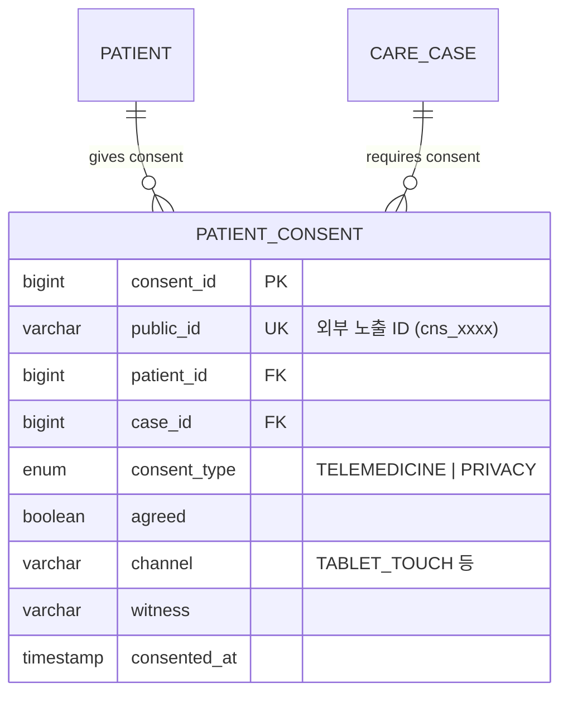

# 도서·산간 방문형 비대면 진료 서비스 — 동의 기능 P1 확장 문서

> **기준 문서**: `MVP_Requirements_v2.md`, `API_Specification.md`, `ERD.md`
>
> **범위**: 비대면 진료 동의 UI, 동의 기록, `PATIENT_CONSENT` 도메인
>
> **상태**: P1. MVP 제외 범위

---

## 1. API 명세

### 1.1 동의 기록

| 항목 | 값 |
|------|-----|
| Method | `POST` |
| Path | `/api/v1/consents` |
| Auth | Bearer Token (ADMIN) 또는 내부 서비스 |

**Request Body**
```json
{
  "patientId": "pat_Zk3mQ9",
  "caseId": "case_T7nLp4",
  "consentTypes": [
    {
      "type": "TELEMEDICINE",
      "agreed": true
    },
    {
      "type": "PRIVACY",
      "agreed": true
    }
  ],
  "channel": "TABLET_TOUCH",
  "witness": "운영자"
}
```

**Response** `201 Created`
```json
{
  "consents": [
    { "consentId": "cns_A1bXq2", "type": "TELEMEDICINE", "agreed": true },
    { "consentId": "cns_C3dYr4", "type": "PRIVACY", "agreed": true }
  ],
  "patientId": "pat_Zk3mQ9",
  "caseId": "case_T7nLp4",
  "allAgreed": true,
  "consentedAt": "2026-03-11T09:50:00+09:00"
}
```

---

### 1.2 동의 현황 조회

| 항목 | 값 |
|------|-----|
| Method | `GET` |
| Path | `/api/v1/consents` |
| Auth | Bearer Token (DOCTOR, ADMIN) |

**Query Params**: `?caseId=case_T7nLp4`

**Response** `200 OK`
```json
{
  "consents": [
    {
      "consentId": "cns_A1bXq2",
      "type": "TELEMEDICINE",
      "agreed": true,
      "channel": "TABLET_TOUCH",
      "consentedAt": "2026-03-11T09:50:00+09:00"
    },
    {
      "consentId": "cns_C3dYr4",
      "type": "PRIVACY",
      "agreed": true,
      "channel": "TABLET_TOUCH",
      "consentedAt": "2026-03-11T09:50:00+09:00"
    }
  ]
}
```

---

## 2. ERD 확장

### 2.1 엔티티



### 2.2 도메인 설명

| 테이블 | 설명 |
|--------|------|
| `PATIENT_CONSENT` | 비대면 진료 동의, 개인정보 처리 동의 기록 |

### 2.3 관련 규칙

| 항목 | 값 |
|------|----|
| `public_id` 접두사 | `cns_` |
| `CONSENT.type` | `TELEMEDICINE \| PRIVACY` |
| 감사 로그 action | `CONSENT_RECORDED` |

### 2.4 핵심 관계 요약

```text
PATIENT → CARE_CASE → PATIENT_CONSENT
```
